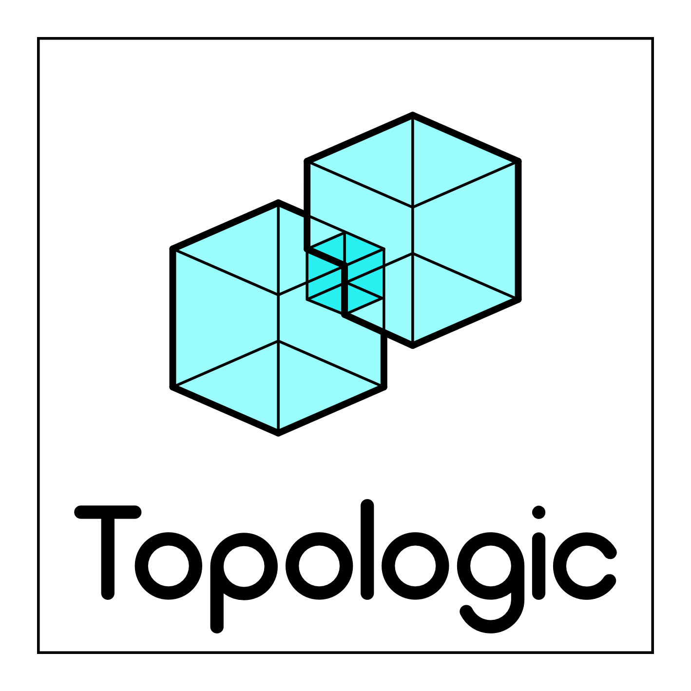

# Topologic

[](image.png)

## Introduction
[**Topologic**](https://topologic.app/) is a FOSS software modelling library enabling hierarchical and topological representations of architectural spaces, buildings and artefacts through non-manifold topology. Topologic is designed as a core library and additional plugins to visual data flow programming (VDFP) applications and parametric modelling platforms commonly used in architectural design practice. These applications provide workspaces with visual programming nodes and connections for architects to interact with Topologic and perform architectural design and analysis tasks.

Topologic is well-suited to create a lightweight representation of a building as an external envelope and the subdivision of the enclosed space into separate spaces and zones using zero-thickness internal surfaces. Because Topologic maintains topological consistency, a user can query these cellular spaces and surfaces regarding their topological data and thus conduct various analyses. For example, this lightweight and consistent representation was found to be well-matched with the input data requirements for energy analysis simulation software. Because Topologic allows entities with mixed dimensionalities and those that are optionally independent (e.g. a line, a surface, a volume) to co-exist, structural models can be represented in a coherent manner where lines can represent columns and beams, surfaces can represent walls and slabs, and volumes can represent solids. In addition, non-building entities, such as structural loads can be efficiently attached to the structure. This creates a lightweight model that is well-matched with the input data requirements for structural analysis simulation software.

## Examples of use
Toplogic can be used to support energy modelling - say dimensioning the windows on different sides of a hospital to avoid summer overheating
Topologic can be be used to plot paths such as fire egress routes, the least disruptive route for a new service pipe or the most congested location in a city layout

## Rigorous Class Hierarchy
TopologicCore contains the following main classes:

* Topology: A Topology is an abstract superclass that stores constructors, properties and methods used by other subclasses that extend it.
* Vertex: A Vertex is a zero-dimensional entity equivalent to a geometry point.
* Edge: An Edge is a one-dimensional entity defined by two vertices. It is important to note that while a topologic edge is made of two vertices, its geometry can be a curve with multiple control vertices.
* Wire: A Wire is a contiguous collection of Edges where adjacent Edges are connected by shared Vertices. It may be open or closed and may be manifold or non-manifold.
* Face: A Face is a two-dimensional region defined by a collection of closed Wires. The geometry of a face can be flat or undulating.
* Shell: A Shell is a contiguous collection of Faces, where adjacent Faces are connected by shared Edges. It may be open or closed and may be manifold or non-manifold.
* Cell: A Cell is a three-dimensional region defined by a collection of closed Shells. It may be manifold or non- manifold.
* CellComplex: A CellComplex is a contiguous collection of Cells where adjacent Cells are connected by shared Faces. It is non- manifold.
* Cluster: A Cluster is a collection of any topologic entities. It may be contiguous or not and may be manifold or non- manifold. Clusters can be nested within other Clusters.

## Build Instructions

Prerequisites:
 - Anaconda or Miniconda
 - On Windows: Microsoft Visual Studio 2022 with "Desktop development with C++" workload installed

1. Clone the repository, switch to the branch and initialize submodules (pybind11)
```
git clone https://github.com/wassimj/Topologic
cd Topologic
git submodule update --init
```
2. Create the Conda-based build environment for the target Python version: the files `conda_env_topologic_*.yml` where `*` is `py310`, `py311`, etc. for Python 3.10, 3.11, etc. define Conda environments named `topologic_py310`, `topologic_py311`, etc. that contain the build dependencies, notably OpenCASCADE, and build tools.  
As of 20221217, Blender comes with Python 3.10; the following instructions are for this version.  
```
conda env create -f conda_env_topologic_py310.yml
```  
(Developer note: keep the contents of the `conda_env_topologic_*.yml` files in sync.)
b
3. Activate the Conda environment:
```
conda activate conda activate topologic_py310
```

4. To build TopologicCore separately, if needed:
```
python build.py --build-type Release --source-dir . --build-dir build --build-target TopologicCore
```
The built library is found in `build/TopologicCore/`.

5. To build the Python extension:
- Windows
```
cd TopologicPythonBindings
python build_windows.py
```
- Linux
 ```
cd TopologicPythonBindings
python build_linux.py
```
- MacOS
```
cd TopologicPythonBindings
python build_macos.py
```

The build output is found in `wheelhouse/`.
The build output is a Python wheel that contains the extension module with TopologicCore linked into it and its OpenCASCADE dependecies "vendored-in" from the Conda-based build environment.  It can be installed with `pip` or its contents can be unzipped.
